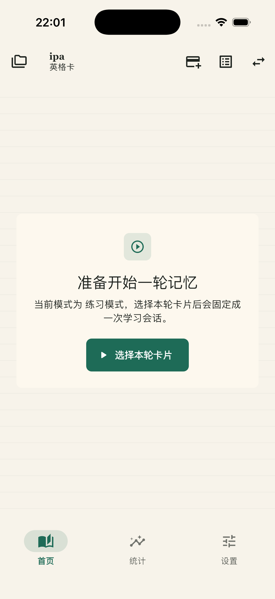
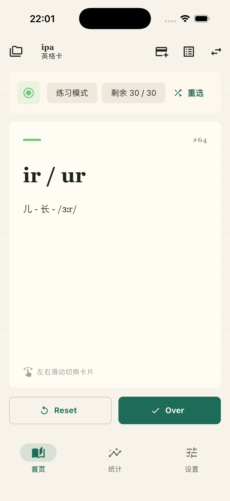
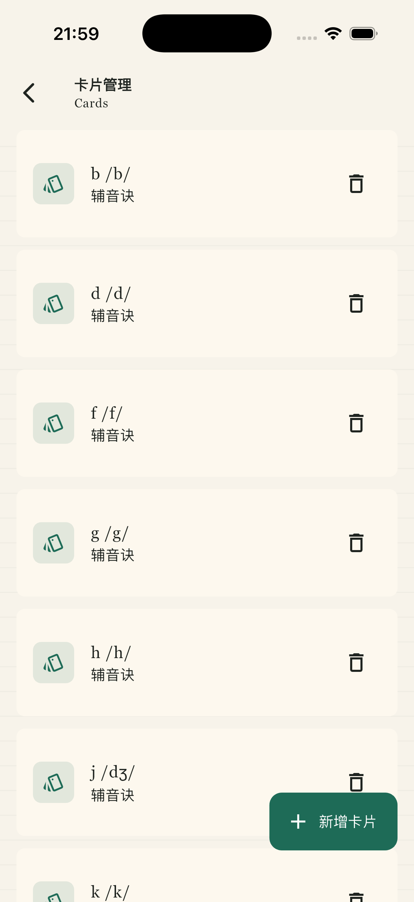
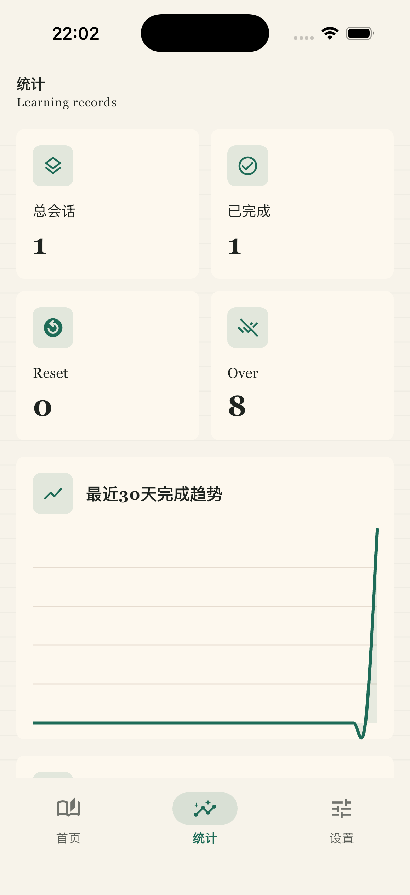

# EngCard

为了更好学习B站UP主【坠落天空】元音诀/辅音诀，做了这个简单的anki卡片记忆组 - EngCard。

EngCard。以“卡片组 + 学习会话”为核心：你先建立自己的卡片组，再从中选择本轮要记忆的卡片，随后通过左右滑动、`Reset` 和 `Over` 完成一轮闭环学习。

## 核心功能

- 卡片组管理：支持新增卡片组，并在组内添加、删除卡片
- 卡片内容：每张卡片包含 `标题` 和可选的 `答案`
- 学习选卡：支持手动勾选、随机选择固定数量、顺序选择固定数量
- 会话固定：一旦开始本轮记忆，本轮卡片就会固定，不受源数据后续变化影响
- 双模式学习：
  - 练习模式：直接显示标题和答案
  - 考试模式：默认只显示标题，点击卡片后再展示答案
- 学习反馈：
  - `Reset`：表示还没记住，需要继续出现
  - `Over`：表示当前卡片本轮已完成，后续循环不再出现
- 智能随机：随机选卡会结合历史被选次数、`Reset` 次数、`Over` 次数做权重计算，尽量避免总是重复抽到少数卡片
- 统计分析：记录学习会话、完成情况、最近 30 日趋势等数据
- 个性设置：支持跟随系统 / 日间 / 夜间外观，调整默认选卡数量和默认学习模式

> 应用内置了一组 `【坠落天空】元音诀/辅音诀` 音标卡片，可在首次进入时直接开始体验。

## 页面预览

### 首页：开始一轮记忆

当你还没有开始本轮学习时，首页会引导你先选择本轮卡片。

### 首页：卡片学习中

进入学习后，可以左右滑动切换卡片，并使用 `Reset` / `Over` 记录当前掌握情况。

### 卡片管理

你可以在卡片管理页集中查看当前卡片组中的内容，并继续新增卡片。

### 统计页

统计页会展示总会话数、完成数、`Reset` / `Over` 次数，以及最近 30 日完成趋势等学习记录。

## 适用场景

- 英语四级 / 六级 / 考研单词
- IPA 音标记忆
- 专业术语、公式、历史时间点
- 面试题关键词速记

## 平台支持

- iOS
- Android

## 说明

EngCard 当前以本地学习和本地数据记录为主，适合个人日常高频复习使用。
